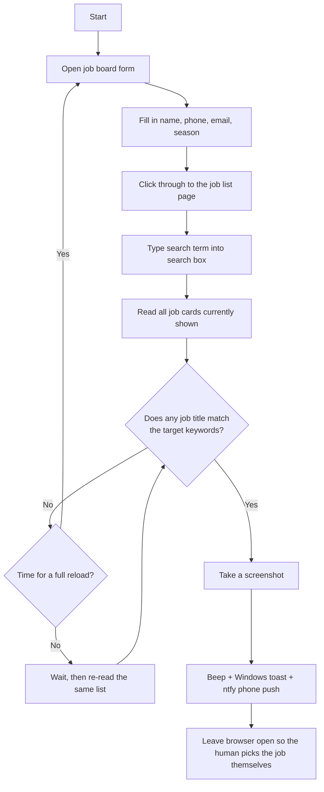

# WAT Job Search Monitor

A small Python bot that watches the **New Step Exchange Program** job board for you, and pings your phone the moment a job you want shows up — so you don't have to sit there refreshing the page all day.

---

## 1. How this idea started

The New Step Exchange Program (WAT job board) posts new host-employer jobs at random times, and popular jobs (like Thai restaurants) get filled within minutes of appearing. Checking the site by hand every few minutes all day is not realistic — you'd miss the job before you even open the tab.

So the idea was: let a script do the watching instead of a human. It should:
- Open the site and search for the job automatically, every couple of minutes.
- Only **tell** the user when it finds something — never click "select this job" for them (picking a job is a decision the person must make themselves).
- Send an alert straight to a phone, so the user doesn't need to keep a screen open at all.

## 2. The problem

| Problem | Why it matters |
|---|---|
| New jobs appear at unpredictable times | Manually checking is unreliable and tiring |
| Good jobs (e.g. Thai restaurants) fill up fast | A few minutes of delay can mean missing out |
| The job list only updates after a full page reload | Just re-searching the same page shows stale data |
| The page UI is unusual (search needs real typing, content is buried in nested iframes) | A naive script (or even copy-pasting text into the search box) doesn't actually filter the list |
| The office network blocks outbound email (SMTP) | A normal "send yourself an email" solution doesn't work here |

## 3. What was tried and why the current design was chosen

- **Email via Gmail SMTP** → failed. The network this script runs on (office PC) blocks SMTP (ports 587/465) at the TLS handshake step, even though normal web browsing works fine.
- **Automating a real Gmail login in the browser to send mail** → failed. Google detects and blocks sign-in attempts from an automation-controlled browser, even when a real person types their real password.
- **LINE Notify** → discontinued by LINE (March 2025), and the replacement (LINE Messaging API) needs a full company account — too heavy for this.
- **ntfy.sh push notifications** ✅ → what the project uses now. It's a plain HTTPS POST request, no account, no API key, no email needed. You just install the free ntfy app and subscribe to one topic name to receive alerts instantly.

## 4. What the script actually does (step by step)



In more detail:

1. **Open the form** — goes to the job board URL (the real page content is nested inside two `<iframe>`s).
2. **Fill the form** — first name, last name, phone, email, and season (e.g. "Summer"), then clicks through to the job list.
3. **Search** — types a search term (e.g. "Thai") into the search box, using real keystrokes with a short delay (the site's filter only reacts to actual typing, not an instant value-set) and waits for the list to filter.
4. **Read job cards** — collects every visible job's title, city, state, and salary.
5. **Check for a match** — compares each job title against a keyword list (e.g. `"lahn"`, `"pad thai"`). This is a narrow, substring match on purpose, so it doesn't accidentally match unrelated jobs with "Thai" in the name.
6. **If no match** — waits, then either:
   - **Soft check**: just re-reads the cards already on the page (cheap, no server load), or
   - **Hard reload**: reloads the whole page and re-fills the form from scratch (this is the only way to actually pull new jobs from the server — the search only filters what's already loaded).
7. **If a match is found**:
   - Saves a screenshot as proof.
   - Plays a beep, shows a Windows toast notification, and sends a push notification via ntfy.sh.
   - Leaves the browser open and stops checking — **the script never clicks "select this job" for you**. You choose and click it yourself.
8. Along the way it also sends:
   - A **heartbeat** notification every so often, just to confirm "still running, nothing found yet."
   - An **error alert** if several checks in a row fail (e.g. site is down or changed), so you know something's wrong without it spamming you every time.
9. If nothing is found after a maximum run time, it sends a final "timed out, nothing found" notification and stops.

## 5. Project files

```
main.py             the actual monitor script (run this)
test_schedule.py     small one-off helper used to test that ntfy notifications work at set times
requirements.txt     Python packages needed
log.txt              log output from the last run (auto-created/updated)
screenshots/         screenshots saved automatically when a matching job is found
```

## 6. Setup

1. Install Python 3.10+.
2. Install the required packages:
   ```powershell
   pip install -r requirements.txt
   playwright install chromium
   ```
3. Install the free **ntfy** app on your phone (Android/iOS), or open [ntfy.sh](https://ntfy.sh) in a mobile browser, and subscribe to the topic name set in `main.py` (`NTFY_TOPIC`).

## 7. Configuration

All settings are at the top of [main.py](main.py) — no command-line flags needed, just edit and save:

| Setting | Meaning |
|---|---|
| `FIRST_NAME`, `LAST_NAME`, `PHONE`, `CONTACT_EMAIL` | Your info, auto-filled into the form |
| `SEASON_VALUE` | Which season to search under (e.g. `"Summer"`) |
| `SEARCH_TERM` | What to type into the job search box (e.g. `"Thai"`) |
| `MATCH_KEYWORDS` | List of words — a job title matches if it contains any of these (case-insensitive) |
| `CHECK_INTERVAL_SECONDS` | How often to do a cheap soft check |
| `HARD_RELOAD_INTERVAL_SECONDS` | How often to do a full reload + re-search (this is what actually finds *new* jobs) |
| `MAX_RUNTIME_HOURS` | Safety limit — script stops automatically after this long |
| `HEARTBEAT_INTERVAL_SECONDS` | How often to send a "still running" ping |
| `ERROR_ALERT_THRESHOLD` | How many failed checks in a row before you get an error alert |
| `NTFY_TOPIC` | Your private ntfy topic name (keep it random/hard to guess — anyone who knows the topic name can read your notifications) |

## 8. Running it

```powershell
python main.py
```

- A visible Chromium browser window will open — leave it running in the background.
- Progress is printed to the console and also saved to `log.txt`.
- When a matching job is found, act fast: check your phone notification and manually click the job in the browser window that's left open for you.

## 9. Important limits / things to know

- **This script never selects a job for you.** It only watches and notifies. Clicking "เลือกงานนี้" (select this job) is always done manually by a human, on purpose.
- It needs the Chromium browser window to stay open and the PC to stay on/unlocked the whole time it runs.
- It relies on the current site's HTML structure (field IDs, iframe nesting, card layout). If the job board's website changes, the script may need updating to match.
- Because this runs on a network that blocks outbound email, all alerts go through ntfy.sh push notifications instead of email.
